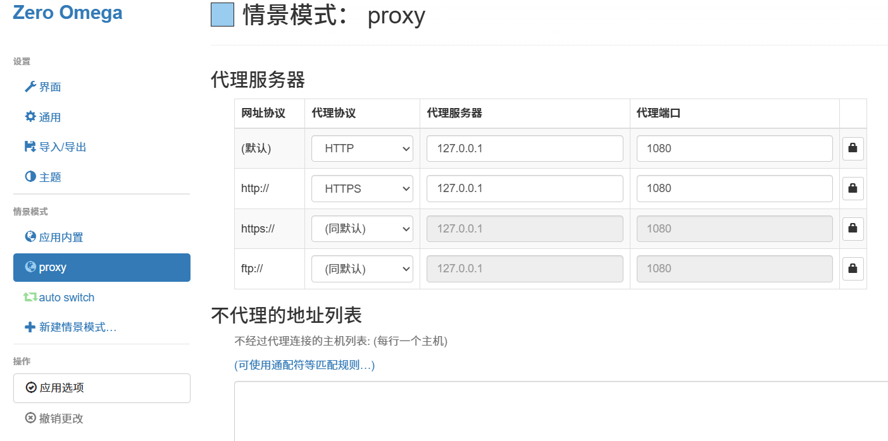

# YIYA 
是一个 ``HTTP/HTTPS`` 隧道代理工具，提供多个模式隧道代理功能，隧道由客户端和服务端构成，客户端负责转发到服务端，服务端负责转发实际请求

## 代理模式
1. 不加密 隧道
2. XOR 加密隧道：使用一对相同的秘钥加解密字节流，秘钥容易被分析
3. mTLS 加密隧道：使用TLS双向认证模式，不泄露根证书绝对安全

## 安装
```shell
go install github.com/Li-giegie/yiya@latest
```

## 快速开始
开始之前，请确保已安装 ``yiya`` 可执行程序，进入源码目录。

启动成功后配置系统代理地址到代理客户端侦听的地址 不管是HTTP还是HTTPS 都配置成 ``127.0.0.1:1080`` 

浏览器ZeroOmega插件配置如图


### 1. 不加密代理隧道
1. 启动服务端 默认服务端侦听 ``127.0.0.1:1081``
    ```shell
    .\yiya.exe -server
    ```
2. 启动客户端 默认侦听 ``127.0.0.1:1080``
    ```shell
    .\yiya.exe
    ```
### 2. mTLS加密隧道
1. 启动服务端
    ```shell
    .\yiya.exe -server -mTLS -rootCertFile .\x509\mTLS\ca.crt -certFile .\x509\mTLS\server.crt -keyFile .\x509\mTLS\server.key
    ```
2. 启动客户端
    ```shell
    .\yiya.exe -mTLS -rootCertFile .\x509\mTLS\ca.crt -certFile .\x509\mTLS\client.crt -keyFile .\x509\mTLS\client.key
    ```
### 3. XOR 加密隧道
1. 启动服务端
   ```shell
   .\yiya.exe -server -xor -key 123456
   ```
2. 启动客户端
   ```shell
   .\yiya.exe -xor -key 123456
   ```
## 生成自签双向认证mTLS证书
在执行命令前，请确保已经安装Openssl
### 第1步：生成根 CA（用于签发所有证书）
```shell
# 生成 CA 私钥
openssl genrsa -out ca.key 2048

# 生成 CA 证书（有效期10年）
openssl req -x509 -new -nodes -sha256 -key ca.key -out ca.crt -days 3650 -subj "/CN=My Root CA"
```
### 第2步：生成服务端证书
```shell
# 生成服务端私钥
openssl genrsa -out server.key 2048

# 生成服务端 CSR
openssl req -new -key server.key -out server.csr -subj "/CN=localhost" -addext "subjectAltName = DNS:localhost, DNS:*.example.com, IP:127.0.0.1"

# 使用 CA 签发服务端证书 Windows 系统该命令不可用
openssl x509 -req -in server.csr -CA ca.crt -CAkey ca.key -CAcreateserial -out server.crt -days 365 -sha256 -extfile <(echo "subjectAltName = DNS:localhost, DNS:*.example.com, IP:127.0.0.1")

# 如果是Windows系统，按下面步骤生成
1. 创建 san.ext 文件并写入: "subjectAltName = DNS:localhost, DNS:*.example.com, IP:127.0.0.1" | Out-File san.ext -Encoding utf8
2. 生成: openssl x509 -req -in server.csr -CA ca.crt -CAkey ca.key -CAcreateserial -out server.crt -days 365 -sha256 -extfile san.ext
```

### 第3步：生成客户端证书
```shell
# 生成客户端私钥
openssl genrsa -out client.key 2048

# 生成客户端 CSR（CN 用于标识客户端身份）
openssl req -new -key client.key -out client.csr -subj "/CN=client1"

# 使用 CA 签发客户端证书
openssl x509 -req -in client.csr -CA ca.crt -CAkey ca.key -CAcreateserial -out client.crt -days 365 -sha256
```